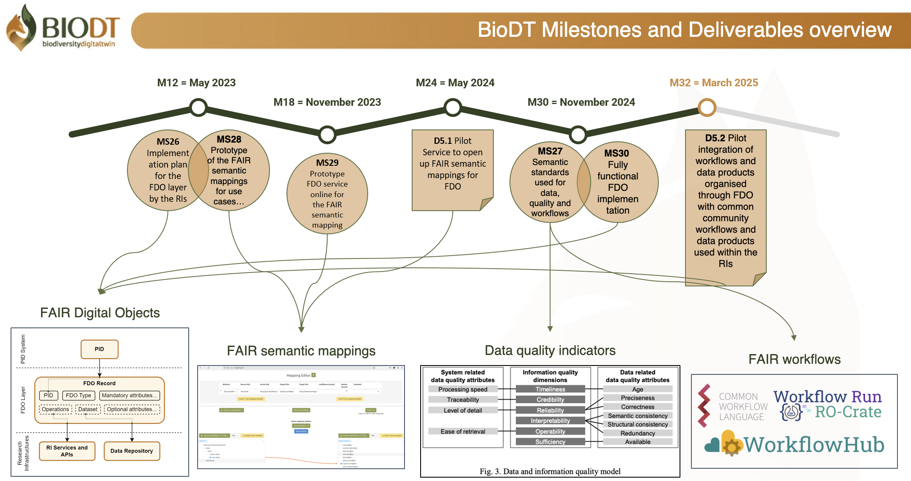
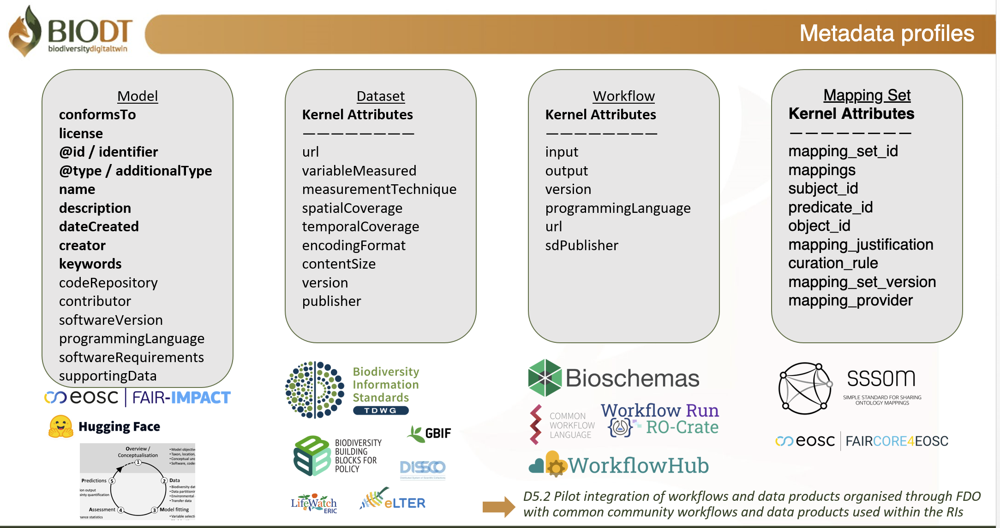

# BioDT - FAIR 

About the Project
The Biodiversity Digital Twin (BioDT) project is an EU-funded initiative running from June 2022 to May 2025. The project includes a dedicated Work Package focused on "Improving Quality of Data, Workflows and Models through FAIR Principles."

Throughout the project, we've addressed several aspects of FAIR implementation:
- Data stream FAIRification
- Collaboration with research infrastructures (GBIF, DiSSCo, LifeWatch ERIC, eLTER)
- Semantic mapping
- Data quality indicators
- Workflow enhancement

This repository serves as a technical companion to our official project outputs, providing:

- Working materials and technical resources related to FAIR principles
- Tools for implementing FAIR across data, software, models, and workflows
- Open access to resources for the wider biodiversity informatics community
- Long-term access to these resources beyond the project's conclusion

Publications & Presentations: Available in our Zenodo community
Official Deliverables: Project milestones and deliverables will be available as they become available afer the formal approval of the EU. 

Image created for the BioDT project by [@juliancervos](https://github.com/juliancervos)

## Content

The information on this repository is distributed as follows:

-   The [Documentation](https://biodt.github.io/biodt-fair/) page: for detailed information about some of the FAIR aspects of BioDT, such as the RO-Crate metadata profiles.
-   The [Issues](https://github.com/BioDT/biodt-fair/issues) and [Pull requests](https://github.com/BioDT/biodt-fair/pulls) tabs: as usual for any code git repository, this is aimed at collaborating in the development of the materials in this repository. Issues can be opened to start a discussion for any topic concerning FAIR in BioDT, while Pull Requests capture discussions around specific code contributions.
-   The [BioDT FAIR Roadmap](https://github.com/orgs/BioDT/projects/1): a planning tool in the Projects tab where important tasks that are planned or actively being worked on are displayed.

### Prototype Digital Twin (pDT) directories

Each prototype Digital Twin (pDT) has its own dedicated directory in this repository where FAIR-related materials are stored, including metadata descriptions for digital objects under development. For the most current FAIR metadata information, please refer to each pDT's individual repository within the BioDT GitHub organization.

### `fdo_profiles/` directory

In this folder, we will store the metadata profiles (and related materials) that we will use in BioDT —which are closely related to the FAIR Digital Objects (FDO) and RO-Crate frameworks. Such profiles are expected to evolve over the course of the project (see the [documentation for the metadata profiles](https://biodt.github.io/biodt-fair/metadata_profiles). So far, the profile work has been focused on:

-   Kernel attributes: this is about the attributes that apply to all digital objects in BioDT, regardless of their purpose. It covers fundamental metadata such as IDs, type, author, license...
-   Model attributes: the `models/` subdirectory covers the metadata for the main software from each pDT.
-   Dataset attributes: the `datasets/` subdirectory includes the profiles for the different types of data used in BioDT.
-   Workflow attributes: the `workflows/` subdirectory focuses on the elements that bring everything together (connecting the data to the models, sending jobs to HPC, etc).
-   Mapping Set attributes: the `mapping-sets/` subdirectory contains resources for mappings between semantic artefacts.
-   Additionally, other auxiliary resources can be found in the `other/` directory.

### `examples/` directory

This directory contains some materials that have been developed mainly for illustrative purposes. For example:

-   `leipzig_workshop/`: This subdirectory contains a Jupyter notebook and some metadata files used during the BioDT workshop in Leipzig, Nov 2023. It aims to give an introduction to FAIR and RO-Crate in the context of data for BioDT.
-   `dataset_ro-crate.ipynb`: It goes over how to turn an existing dataset into an RO-Crate, with descriptions on the main elements of RO-Crate and how some FAIR principles are achieved. To check it out, simply click on the file and go through the text.
-   `fdo_examples_basic.ipynb`: Short illustration of what FDOs can enable within BioDT, developed as an example for the MS26 milestone. To be further extended with more content (e.g. an RO-Crate example for collection records).
-   `fdo_definitions.py`: To support the previous notebooks, this contains some example class definitions of FAIR Digital Objects (FDOs) classes for BioDT. This will be further developed as the project progresses to reflect our understanding of how FDOs can function within BioDT.

### Usage

This repo contains mostly JSON metadata files and isolated Python scripts taken from other code repositories. Any relevant software dependencies needed to run such scripts can be installed using [Poetry](https://python-poetry.org/) (see `pyproject.toml`).

# RO-Crate 

The RO-Crate framework has been adopted in the BioDT project to build FAIR Digital Twins and to address the challenges of packaging and describing different digital objects in a machine-actionable and interoperable way. We have created profiles (https://biodt.github.io/biodt-fair/metadata_profiles) which consists of a number of metadata attributes, have been designed to strike a balance between providing enough details about the digital object they are describing, but remaining as minimal as possible. While most of the attributes come from Schema.org (the standard vocabulary that RO-Crate relies on), other initiatives and community standards have been taken into consideration for the attribute selection. The metadata structure provides detailed provenance, including authorship, licensing, and also more type-specific information, such as spatial and temporal coverage (in the case of datasets) or software version and requirements (for models). Each component, such as vegetation cover data and methodological documentation, is uniquely identified using persistent identifiers.

Image created for the BioDT project by [@juliancervos](https://github.com/juliancervos)

## License

[European Union Public Licence v. 1.2](https://eupl.eu/1.2/en/)
