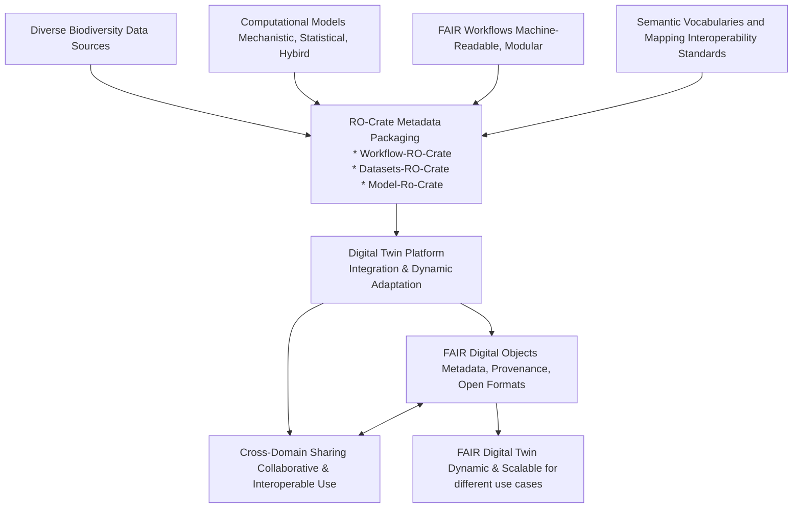

A simple schematic to show how the FAIR Digital Twin and RO-Crate integrage components. 

```mermaid
graph TD
    A[Diverse Biodiversity Data Sources] --> B[RO-Crate Metadata Packaging 
    * Workflow-RO-Crate
    * Datasets-RO-Crate 
    * Model-Ro-Crate ]
    C[Computational Models Mechanistic, Statistical, Hybird] --> B
    D[FAIR Workflows Machine-Readable, Modular] --> B
    E[Semantic Vocabularies and Mapping Interoperability Standards] --> B
    B --> F[Digital Twin Platform
    Integration & Dynamic Adaptation]

    F --> G[FAIR Digital Objects 
    Metadata, Provenance, Open Formats]
    F --> H[Cross-Domain Sharing Collaborative & Interoperable Use]
    G <-->H 
    G -->I[FAIR Digital Twin 
    Dynamic & Scalable for different use cases ]
```
